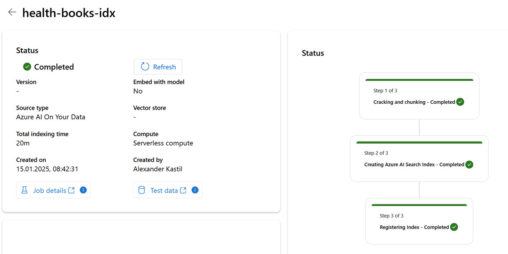
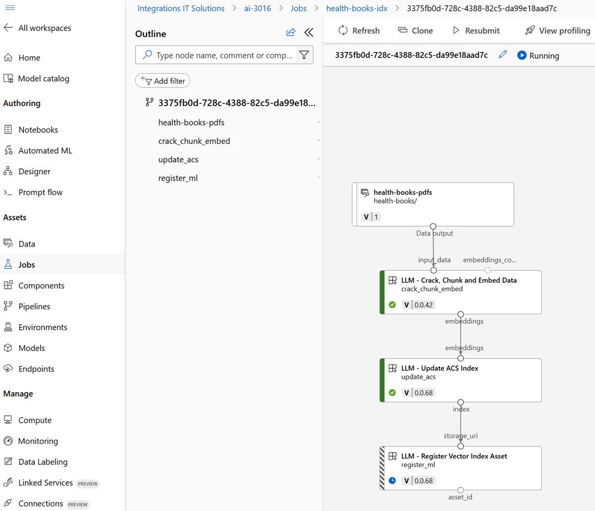

# Create a generative AI app that uses your own data (RAG)

## Links & Resources

[Azure AI Search](https://learn.microsoft.com/en-us/azure/search/search-what-is-azure-search)

[Vectors in Azure AI Search](https://learn.microsoft.com/en-us/azure/search/vector-search-overview)

[RAG in Azure AI Studio](https://learn.microsoft.com/en-us/azure/ai-studio/concepts/retrieval-augmented-generation?source=recommendations)

[RAG in Azure AI Search](https://learn.microsoft.com/en-us/azure/search/retrieval-augmented-generation-overview)

## Demos

- First upload [health-books](health-books/) as `data` and the create an index

  

- Watch creation of the index at [Azure Machine Learning Studio](https://ml.azure.com/)

  

- Create `health-agent-rag` using Chat-Flow-Template: `Multi-Round Q&A on Your Data`

- Update the system message in prompt in `prompt_variants`:

  ```prompt
  * Assist users with health related issues, especially dietary questions designed to answer questions from users in a designated context. When presented with a scenario, you must reply with accuracy to inquirers' inquiries using only descriptors provided in that same context. If there is ever a situation where you are unsure of the potential answers, simply respond with "I don't know.

  Your Capabilities are:
  - Answer general questions about health lifestyle.
  - Provide insights about nutrients.
  - Provide recipes about keto diet.
  - Give tips on how to lose weight

  Please add citation after each sentence when possible in a form "(Source: citation)".
  ```

- Update and explain the following elements in the `flow`:

  - modify_query_with_history: Connection
  - lookup: Registered Index -> Name, Query type -> Hybrid
  - chat with context: Connection

## Labs

[Build a RAG-based agent with your own data using Azure AI Foundry](https://learn.microsoft.com/en-us/training/modules/build-copilot-ai-studio/)
